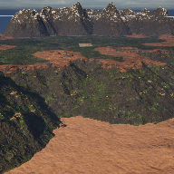

OpenWorldMap

OpenWorldMap is a 1009x1009 open-world terrain designed in Unreal Engine 5.4.2. This is my first publicly shared map, built following SmartPoly's video lesson: https://www.youtube.com/watch?v=6_5_GiYgCis

✨ Features

1009 x 1009 world size

🌲 Forested area

🌾 Open plains 

⛰️ Mountain terrain

🌊 Coastal regions 

_________________________

Learn to make your own maps visit SmartPoly's channel: https://www.youtube.com/@SmartPoly

Clone the project with:

git clone git@github.com:B-Rett89/OpenWorldMap.git

Then open the project in Unreal Engine 5.4.2.
